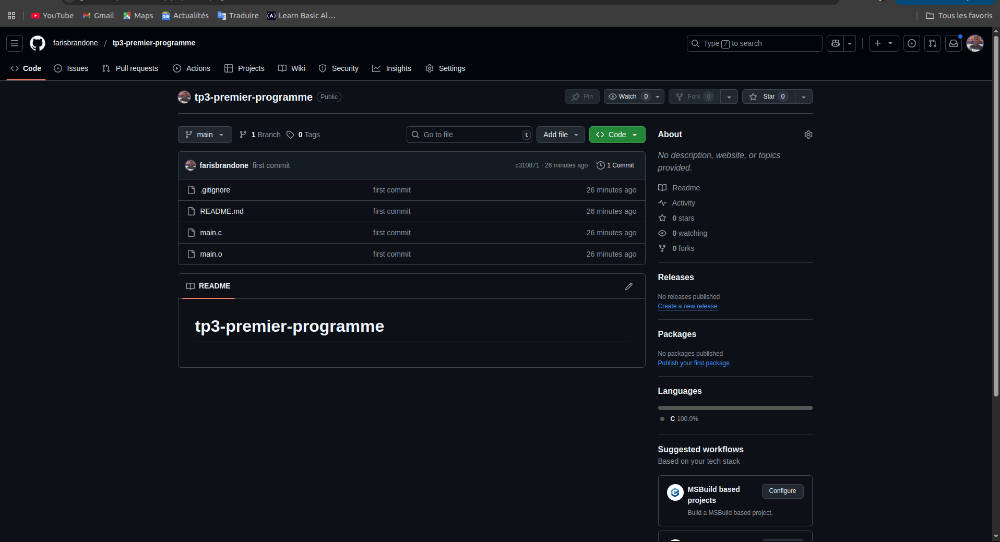
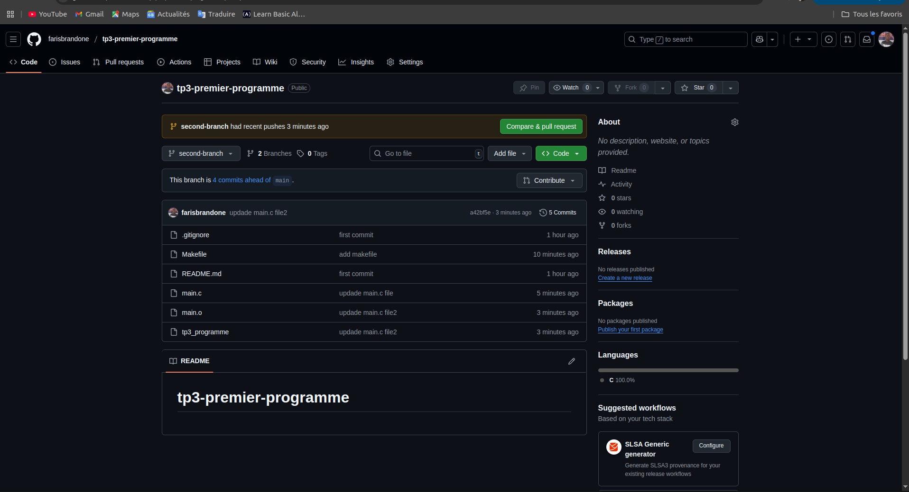

# TP3 - Premier programme en C sous Linux

Ce projet démontre l'installation des outils de développement, la création d'un programme C simple, sa gestion avec Git/GitHub et la compilation via Makefile.

## 📋 Prérequis
- Système Linux (Debian/Ubuntu)
- Accès terminal avec droits `sudo`

## 🛠️ Installation

### 1. Installation de Git
```bash
sudo apt-get update
sudo apt-get install git-all
git --version
```

### 2. Installation de Code::Blocks (optionnel)
```bash
tar -xvf codeblocks_25.03_amd64_debian12.tar.xz # Décompression
sudo dpkg -i ./*.deb                  # Installation
sudo apt install -f                   # Résolution des dépendances
codeblocks --version                  # Vérification
```

## 🚀 Configuration du projet

### Structure des dossiers
```bash
mkdir -p training-linux/TP3-Premier-programme
cd training-linux/TP3-Premier-programme
```

### Programme C (`main.c`)
```c
#include <stdlib.h>
#include <stdio.h>

int somme(int);

int main(int argc, char **arg) {
    int i = 10;
    printf("La somme des %d entiers est %d \n", i, somme(i));
    return EXIT_SUCCESS;
}

int somme(int i) {
    int resultat = 0;
    for (int k = 0; k <= i; k++)
        resultat += k;
    return resultat;
}
```

## 🔧 Compilation avec Makefile

### Fichier `Makefile`
```makefile
CC = gcc
CFLAGS = -Wall -Wextra -g
TARGET = tp3_programme
SRCS = main.c
OBJS = $(SRCS:.c=.o)

all: $(TARGET)

$(TARGET): $(OBJS)
	$(CC) $(CFLAGS) -o $@ $^

%.o: %.c
	$(CC) $(CFLAGS) -c $<

clean:
	rm -f $(OBJS) $(TARGET)

re: clean all
```

### Commandes
```bash
make        # Compile
./tp3_programme  # Exécute
make clean  # Nettoie
make re     # Recompile
```

## 📦 Gestion avec Git/GitHub

### Initialisation
```bash
git init
git config --global user.email "Vous@exemple.com"
git config --global user.name "Votre Nom"
```

### Connexion SSH
```bash
ssh-keygen -t ed25519 -C "farisbrandone@yahoo.com"
cat ~/.ssh/id_rsa.pub  # À copier dans GitHub > Settings > SSH Keys
```

### Premier push
```bash
git add .
git commit -m "Initial commit"
git branch -M main
git remote add origin git@github.com:farisbrandone/tp3-premier-programme.git
git push -u origin main
```

### Création d'une branche
```bash
git checkout -b second-branch
git push -u origin second-branch
```

## 📸 Captures d'écran
- 
- 

## 📝 Notes
- Le Makefile génère un exécutable `tp3_programme`
- Options de compilation :
  - `-Wall -Wextra` : Active tous les avertissements
  - `-g` : Génère des symboles de débogage

---

