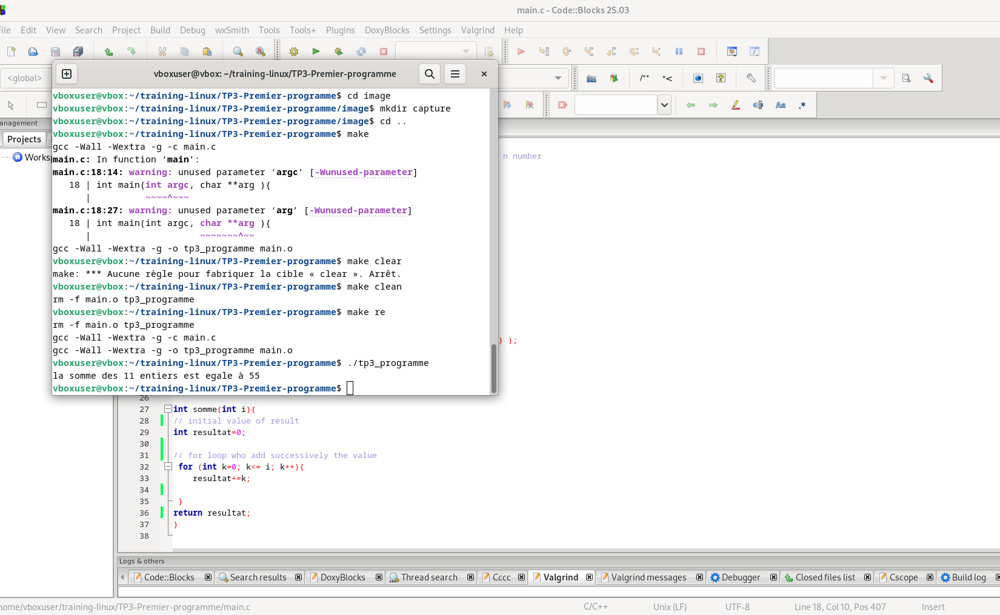

# TP3 - First C program under Linux

This project demonstrates how to install development tools, create a simple c project, manage it with git and github and compile it with Makefile.

## 📋 Prérequis
- Linux system (Debian/Ubuntu)
-Access terminal with `sudo`

## 🛠️ Installation

### 1. Installation of Git
```bash
sudo apt-get update
sudo apt-get install git-all
git --version
```

### 2. Installation of Code::Blocks
```bash
tar -xvf codeblocks_25.03_amd64_debian12.tar.xz # decompression
sudo dpkg -i ./*.deb                  # Installation
sudo apt install -f                   # resolving dependencies
codeblocks --version                  # Verification
```

## 🚀 Setting project

### Folder structures
```bash
mkdir -p training-linux/TP3-Premier-programme
cd training-linux/TP3-Premier-programme
```

## 🔧 Compilation with Makefile

### Commandes
```bash
make        # Compile
./tp3_programme  # Exécute
make clean  # Nettoie
make re     # Recompile
```

## 📦 Manage with Git/GitHub

### Initialisation
```bash
git init
git config --global user.email "Vous@exemple.com"
git config --global user.name "Votre Nom"
```

### SSH Connexion
```bash
ssh-keygen -t ed25519 -C "farisbrandone@yahoo.com"
cat ~/.ssh/id_rsa.pub  # To copy on GitHub > Settings > SSH Keys
```

### First push
```bash
git add .
git commit -m "Initial commit"
git branch -M main
git remote add origin git@github.com:farisbrandone/tp3-premier-programme.git
git push -u origin main
```

### Create branch
```bash
git checkout -b second-branch
git push -u origin second-branch
```

## 📸 screenshot

## Result capture
- 

## 📝 Notes
- The Makefile generates an executable `tp3_programme`
-  compilation Options :
  - `-Wall -Wextra` : activates all warnings
  - `-g` : generates debugging symbols

---


