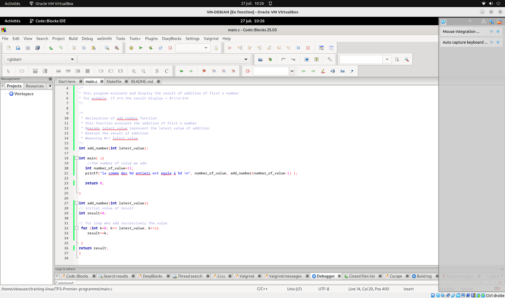
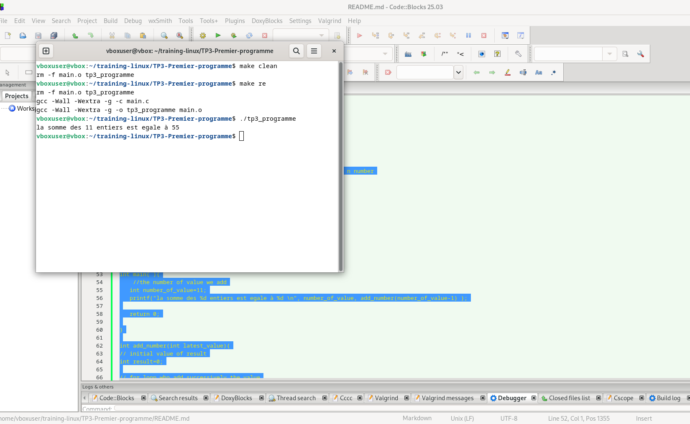
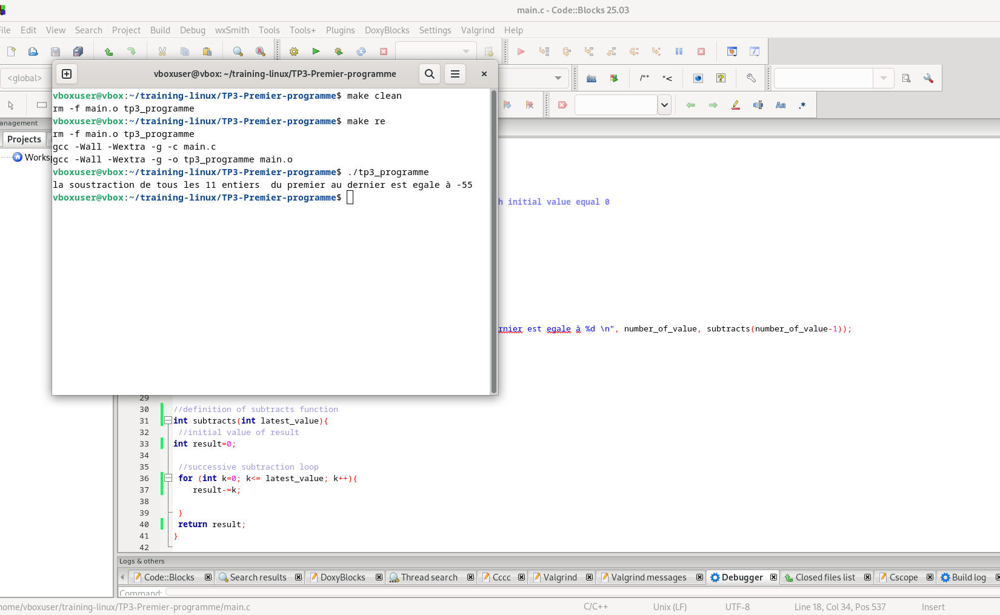

# TP3 - Premier programme en C sous Linux

Ce projet démontre l'installation des outils de développement, la création d'un programme C simple, sa gestion avec Git/GitHub et la compilation via Makefile.

## 📋 Prérequis
- Système Linux (Debian/Ubuntu)
- Accès terminal avec droits `sudo`

## 🛠️ Installation

### 1. Installation de Git
```bash
sudo apt-get update
sudo apt-get install git-all
git --version
```

### 2. Installation de Code::Blocks (optionnel)
```bash
tar -xvf codeblocks_25.03_amd64_debian12.tar.xz # Décompression
sudo dpkg -i ./*.deb                  # Installation
sudo apt install -f                   # Résolution des dépendances
codeblocks --version                  # Vérification
```

## 🚀 Configuration du projet

### Structure des dossiers
```bash
mkdir -p training-linux/TP3-Premier-programme
cd training-linux/TP3-Premier-programme
```

### Programme C (`main.c`)
```c
#include <stdlib.h>
#include <stdio.h>

/*
* this program evaluate and display the result of addition of first n number
* for exemple, if n=3 the result display = 0+1+2+3=6
*/

/*
 * declaration of somme function
 * this function evaluate the addition of first i+1 number
 * @params i represent the latest value of addition
 * @return the result of addition
 * @warning 0=< i
*/
int somme(int i);

int main( ){
    //the number of value we add
   int i=11;
   printf("la somme des %d entiers est egale à %d \n", i, somme(i-1) );

   return 0;

}

int somme(int i){
// initial value of result
int resultat=0;

// for loop who add successively the value
 for (int k=0; k<= i; k++){
    resultat+=k;

 }
return resultat;
}

```

## 🔧 Compilation avec Makefile

### Fichier `Makefile`
```makefile
CC = gcc
CFLAGS = -Wall -Wextra -g
TARGET = tp3_programme
SRCS = main.c
OBJS = $(SRCS:.c=.o)

all: $(TARGET)

$(TARGET): $(OBJS)
	$(CC) $(CFLAGS) -o $@ $^

%.o: %.c
	$(CC) $(CFLAGS) -c $<

clean:
	rm -f $(OBJS) $(TARGET)

re: clean all
```

### Commandes
```bash
make        # Compile
./tp3_programme  # Exécute
make clean  # Nettoie
make re     # Recompile
```

## 📦 Gestion avec Git/GitHub

### Initialisation
```bash
git init
git config --global user.email "Vous@exemple.com"
git config --global user.name "Votre Nom"
```

### Connexion SSH
```bash
ssh-keygen -t ed25519 -C "farisbrandone@yahoo.com"
cat ~/.ssh/id_rsa.pub  # À copier dans GitHub > Settings > SSH Keys
```

### Premier push
```bash
git add .
git commit -m "Initial commit"
git branch -M main
git remote add origin git@github.com:farisbrandone/tp3-premier-programme.git
git push -u origin main
```

### Création d'une branche
```bash
git checkout -b second-branch
git push -u origin second-branch
```

## 📸 Captures d'écran

# code capture
- 
- 

# Result capture
- 
- 

## 📝 Notes
- Le Makefile génère un exécutable `tp3_programme`
- Options de compilation :
  - `-Wall -Wextra` : Active tous les avertissements
  - `-g` : Génère des symboles de débogage

---

